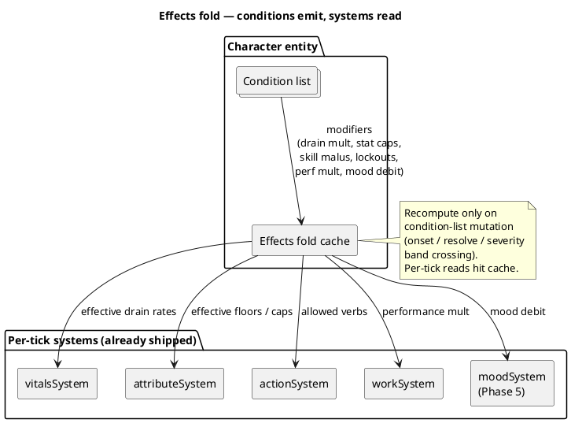
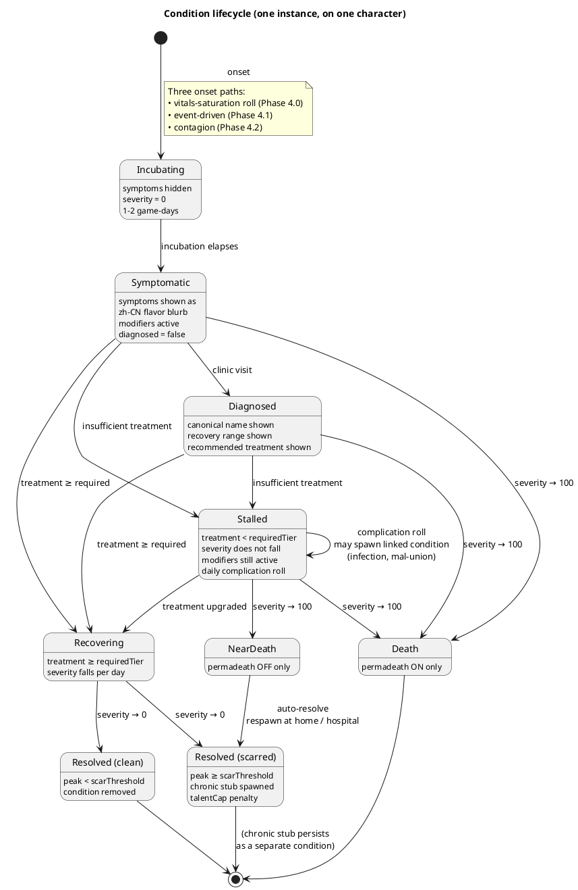
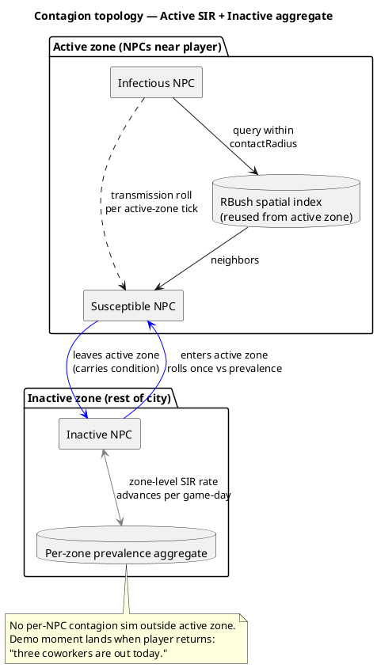

# Physiology (Phase 4)

Vitals are bars the player tops up. Physiology is the story of what happens
when they don't. Where vitals say *"you are hungry now,"* physiology says
*"you caught the flu from your coworker on Tuesday and have been off-shift
for three days."*

Modeled on RimWorld's *hediff* layer (Project Zomboid's moodles in the
diagnosis UX): discrete, named, composable conditions with explicit onset,
recovery, and consequences. Not another meter. The player should be able to
answer the question *"what is wrong with me?"* in named pieces.

## Design goals

1. **Every condition is a story beat.** Acute, injury, or chronic — each maps
   to one log line on onset and one on recovery. The event log is the story
   ([DESIGN.md](../DESIGN.md) principle 4).
2. **Diagnosis is the verb.** The player feels symptoms (flavor strings); a
   clinic visit reveals the condition (the named thing). That gap is the
   core decision driver of this layer.
3. **Failure leaves a souvenir.** Untreated severe conditions resolve into
   chronic stubs — scars, weak knee, recurring cough — that persist after
   recovery. With permadeath off, the character keeps playing but carries
   the memento. With permadeath on, the character dies.
4. **Contagion turns the world into the player's risk landscape.** A flu in
   the dock workforce isn't a quest — it's a thing that's happening that the
   player has to navigate (or catch).

## The Condition trait

A character (player or NPC) carries a **list** of `Condition` instances.
Composable: a flu + a bruised ankle + a hangover all coexist on the same
character at the same time, each with independent state.

| Field | Notes |
|---|---|
| `id` | Data-driven; references a row in `src/data/conditions.json5` |
| `severity` | 0–100; advances/recedes per game-day per the row's curve |
| `bodyPart` | Optional; injuries pin to one of {head, torso, leftArm, rightArm, leftLeg, rightLeg, hands, eyes}. Illnesses are systemic (`null`) |
| `onsetDay` | Game-day stamp; drives log-line phrasing and seniority |
| `source` | Free-text origin tag — `"caught from 李明 at the dock"`, `"slipped on stairs"` — apophenia fuel |
| `infectious` | If true, contagion system reads `transmissionRate` and `contactRadius` from the row |
| `requiredTreatmentTier` | Per-row gate: `none` / `pharmacy` / `clinic`. Severity decays only when active treatment ≥ this tier. Below it, severity stalls. |
| `complicationRisk` | Per-row daily probability of spawning a linked condition (infection, mal-union, etc.) when treatment < required |
| `diagnosed` | Player-only flag; flips true after a clinic visit. NPCs are always "diagnosed" from the inspector's POV |

State is per-instance, not per-condition-id — the same character can have two
different `injury` instances on two different body parts. Save layer
serializes the list as part of the character entity; round-trips via
`EntityKey` on the holder, no new key namespace needed.

## Effects-fold architecture

Conditions **emit modifiers**; they do not run their own tick loop. Existing
per-tick systems read an effective sheet that's the fold of every active
condition's modifiers over the base character. No system has to know "the
player has a flu" — they read effective drain rates and effective caps.



Modifier channels a condition row may emit:

| Channel | Shape | Example |
|---|---|---|
| Vital drain | multiplier on hunger/thirst/fatigue/hygiene drain | flu → fatigue ×1.5 |
| Attribute floor/cap | hard cap while active | broken arm → Strength ≤ 30 |
| Skill malus | fixed minus on effective skill | concussion → −20 mental skills |
| Action lockout | block a verb entirely | severe leg injury → no `working` at labor |
| Work performance | multiplier on `workSystem` output | flu → ×0.6 even when working |
| Mood debit | flat tick debit (Phase 5) | grief → −1 mood/hour |

## The five condition families

Bounded scope; not infinite categories. Each family teaches a different lesson.

| Family | Onset trigger | Default `requiredTier` | Duration | What it teaches |
|---|---|---|---|---|
| **Acute illness** (cold, flu, food poisoning, hangover) | Vital saturation, contagion, bad food, alcohol | `none` (severe flu → `pharmacy`) | 1–7 days | "Stay home and recover" |
| **Injury** (sprain, cut, fracture, burn, concussion) | Environmental events, combat (Phase 5+) | `pharmacy` (severe → `clinic`) | 3–30 days | "Patch it or it won't heal" |
| **Chronic** (scar, weak knee, recurring cough, asthma) | Resolved-with-souvenir from severe acute or injury; rarely innate | n/a — does not resolve | Permanent | "Your character has history" |
| **Mental** (anxiety, withdrawal, grief) — *Phase 5 stub only* | Sustained low mood, addiction, NPC death | TBD | Variable | Reserved for [social/relationships.md](../social/relationships.md) and the mood layer |
| **Pregnancy / aging** — *deferred* | — | — | — | Data shape supports it; no Phase 4 work |

Phase 4 ships **acute + injury + chronic-as-souvenir**. Mental gets a stub
row in the schema so the data model doesn't churn when Phase 5 fills it in.

## Condition lifecycle



**Severity update** (once per game-day, not per tick):

```
if treatment_tier >= required_tier:
    target = base_recovery_rate
           × endurance_multiplier        (Endurance 0..100 → 0.5×..1.5×)
           × treatment_multiplier        (pharmacy 1.5× / clinic 2.0×)
           × (1.0 - severity / 100)      (high severity recovers slower)
    severity -= target
else:
    severity stays                       (modifiers remain active)
    roll complicationRisk                (on hit, spawn linked condition —
                                          open wound → infection,
                                          fracture → mal-union scar)

peak = max(peak, severity)               (tracked for scar branching)
```

Self-treat (sleep + water at home) only resolves conditions where
`requiredTreatmentTier = none` — colds, hangovers, mild food poisoning. A
sprained ankle or a deep cut **stalls** at home: severity won't fall, the
character keeps suffering the modifiers (Strength capped, walking slower,
work perf reduced), and each day rolls a complication chance. This is what
makes the diagnosis loop carry weight: misjudging a "minor strain" that's
actually a fracture costs you several days of stalled recovery and possibly
an infection layered on top, while a clinic visit would have routed you
straight into the recovering arc.

**Onset triggers, in detail:**

- **Vitals-saturation roll** — sustained Hygiene > 70 → cold roll p ≈ 0.05/day; flop-tier sleep > 3 consecutive nights → cold roll p ≈ 0.10/day; `reveling` above an alcohol threshold seeds a hangover automatically.
- **Event-driven** — specific actions inflict specific conditions: high Fatigue + walking rolls slip/sprain; labor work at low Reflex rolls cut/burn; combat (Phase 5+) becomes the dominant source.
- **Contagion** — see [Contagion](#contagion-phase-42).

**Diagnosis is player-only.** Symptomatic conditions on the player show as a
zh-CN flavor blurb (*"你浑身发冷,关节酸痛"*); the canonical name is hidden
until a clinic visit flips `diagnosed = true`. This is the central decision
the system rewards: **is it bad enough to pay for a diagnosis?** A cold lets
you guess and ride it out. A strain that's actually a hairline fracture
punishes guessing. NPCs skip this layer entirely — inspector mode shows their
condition list named.

**Scar threshold is the souvenir mechanism.** Same illness, treated early,
leaves nothing; ignored, leaves a chronic stub on the same body part with a
permanent `talentCap` penalty. The scar is the apology for surviving.

## Treatment options

Treatment is **tiered**, and recovery is gated on the tier matching or
exceeding the condition's `requiredTreatmentTier`. Choosing a tier below
the required gate does not slow recovery — it stalls it (and rolls
complications). Choosing a tier above does not speed it further; the table's
multiplier is applied at-or-above-required only.

| Treatment | Effective tier | Cost | Recovery mult (when ≥ required) | Diagnosis | Notes |
|---|---|---|---|---|---|
| **Untreated** (sleep + water) | `none` | Free | 1.0× | No | Resolves only `requiredTier = none` rows (cold, hangover, mild food poisoning) |
| **Self-treat with First Aid (skill ≥ 30)** | `pharmacy` for unlocked verbs (bandage, splint, clean wound); else `none` | Free + skill XP | 1.0×–1.3× (skill scales) | No | Lets you handle minor injuries at home; no help with internal illnesses or `clinic`-tier conditions |
| **Pharmacy** | `pharmacy` | Money | 1.5× | No | Pharmacy interactable; Chemistry skill (Phase 5) lets player craft meds instead of buy |
| **Civilian clinic** | `clinic` | Money (medium) | 2.0× | Yes | Walk-in; reveals condition name; prescribes |
| **AE clinic** | `clinic` | AE rep + small money | 2.0× + reduced scar threshold | Yes, including subtle conditions | Gated on AE rep tier; legible faction benefit (the kind a silent gate would hide) |

The AE clinic gate is the design's anchor for the *"factions matter even if
you're a civilian"* read. A player without AE rep will catch a flu and ride
it out at a civilian clinic. A player with AE rep gets early-stage detection
and lower scar rates. The benefit is perceivable — better outcomes, named in
the log — and the gate is reachable through the existing AE rep loop.

## Contagion (Phase 4.2)

Two-tier model: per-character SIR inside the active zone, coarse aggregate
prevalence outside. The handoff happens when a character crosses the
active-zone boundary.



**Perf budget.** N = 200 active NPCs, up to 50 infectious. Per active-zone
tick: ~50 broad-phase queries × ~10 hits = 500 contact rolls. Target
<0.3 ms/tick at 1× speed. Reuses existing RBush; no new spatial index.
Profile gate: `CONTAGION_PROF=1`.

**First shipped contagious condition: flu.** `transmissionRate` ≈ 0.05 per
contact-tick, 5–7 day duration, mid-severity baseline. This is the Phase 4
demo line — *"a flu sweeps a workplace"* — earned mechanically.

## Death and the souvenir

The two terminal branches in the [lifecycle diagram](#condition-lifecycle):

| Permadeath | severity → 100 | Outcome |
|---|---|---|
| ON (locked at creation) | + body-part-fatal flag | Game over |
| OFF (default) | any | Near-death; respawn at home / hospital; chronic stub + permanent `talentCap` penalty (e.g., "scarred lungs" → Endurance cap −5) |

Even with permadeath off, severe failures **bite**. The `talentCap`
reduction is the teeth; the chronic-condition row is the story.
Reload-as-undo is no longer free.

## Integration with shipped systems

| System | What physiology adds |
|---|---|
| Vitals ([index.md](index.md)) | Mood gets a condition-modifier feed; saturation rolls feed onset |
| Attributes ([attributes.md](attributes.md)) | Conditions can floor or cap stat values; HP-based stress rows in attributes already anticipate this |
| Skills ([skills.md](skills.md)) | First Aid speeds injury recovery; Medicine improves clinic outcomes for NPC patients (Phase 5+ player-as-medic verb); Chemistry crafts meds |
| Work | Reduced perf at low severity; auto-call-in-sick (no shift, no firing) above a per-job severity threshold; same-day re-roll if you push through |
| Active zone | Contagion only inside the zone; aggregate model outside |
| Save ([../saves.md](../saves.md)) | Condition list serialized on the character entity; chronic stubs survive scene migration (player-portable) the same way Vitals do today |
| Event log | Onset / recovery / diagnosis / scar / death each emit one zh-CN line; *"李明感冒了"* / *"你的扭伤好了,但留下了一道旧伤"* |
| Inspector | Conditions visible on every entity, NPC and player |
| Hyperspeed | Onset and recovery happen at game-day rollover, which already triggers an interrupt — committed-skip wakes the player on diagnosis-relevant changes the same way it wakes on vital thresholds |

## Phase 4 split

| Phase | Scope | Demo |
|---|---|---|
| **4.0** | Conditions trait + effects-fold cache + onset/recovery scaffolding + symptom-vs-name UI + clinic interactable + the common cold | "I caught a cold from sleeping at a flop and lost a workday" |
| **4.1** | Injuries + body parts + First Aid skill verbs + chronic-stub mechanism (scars, weak-knee Endurance cap reduction) | "I sprained my ankle and limp until I get it splinted" |
| **4.2** | Contagion (SIR on active, aggregate on inactive) + flu + AE-clinic-as-faction-perk | "A flu sweeps the dock and I have to choose: skip a shift, push through, or burn AE rep on a clinic visit" |

Each sub-phase ships independent player-visible play. 4.1 and 4.2 are
sequenceable in either order; 4.0 must land first because both depend on
the trait + fold cache.

## Open questions

- **Mental-health Phase 5 boundary**: anxiety/grief/withdrawal conditions
  are designed-in here as schema rows but populated in the mood layer.
  Decision needed: does grief instantiate as a condition, or as a
  long-running mood debuff in the mood system? Defer until mood lands.
- **Childhood / starter chronics**: do some characters spawn with chronic
  conditions (asthma, scar from a creche-era accident) at character
  creation? RimWorld's "Genesis"-style starting hediffs add flavor cheaply.
  Out of scope for Phase 4.0; revisit at character-creator UI work.
- **NPC injury source variety**: pre-Phase-5 (no combat), the only injury
  source for NPCs is environmental rolls. Risk: NPC injury rates feel low
  and the body-part system reads as player-only. Acceptable for 4.1 ship,
  flagged for tuning.
- **Diagnosis cost vs. tutorial leakage**: first-clinic-visit free?
  Probably yes — teaches the verb. Decision deferred to UX pass.

## Related

- [index.md](index.md) — vitals saturation seeds onset; mood reads condition modifiers
- [attributes.md](attributes.md) — Endurance scales recovery; conditions floor/cap stats
- [skills.md](skills.md) — First Aid, Medicine, Chemistry are the skill-side levers
- [../phasing.md](../phasing.md) — Phase 4 sub-phase ordering
- [../saves.md](../saves.md) — condition list round-trips via EntityKey
