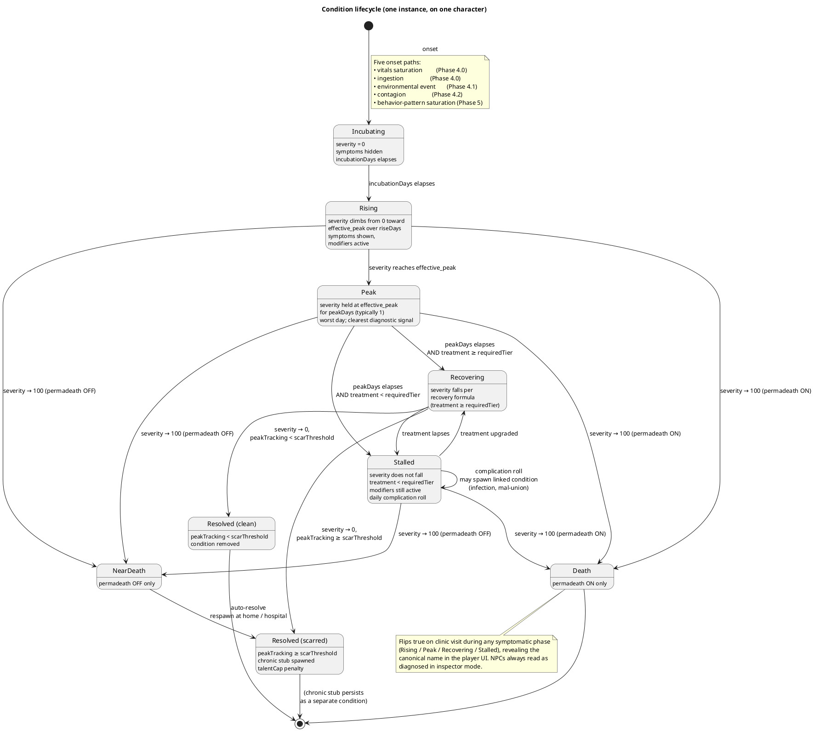
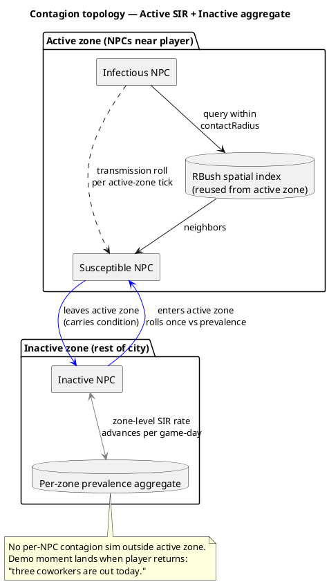

# Physiology (Phase 4)

Vitals are bars the player tops up. Physiology is the story of what happens
when they don't. Where vitals say *"you are hungry now,"* physiology says
*"you caught the flu from your coworker on Tuesday and have been off-shift
for three days."*

Modeled on RimWorld's *hediff* layer (Project Zomboid's moodles in the
diagnosis UX): discrete, named, composable conditions with explicit onset,
recovery, and consequences. Not another meter. The player should be able to
answer the question *"what is wrong with me?"* in named pieces.

## Design goals

1. **Every condition is a story beat.** Acute, injury, or chronic — each maps
   to one log line on onset and one on recovery. The event log is the story
   ([DESIGN.md](../DESIGN.md) principle 4).
2. **Diagnosis is the verb.** The player feels symptoms (flavor strings); a
   clinic visit reveals the condition (the named thing). That gap is the
   core decision driver of this layer.
3. **Failure leaves a souvenir.** Untreated severe conditions resolve into
   chronic stubs — scars, weak knee, recurring cough — that persist after
   recovery. With permadeath off, the character keeps playing but carries
   the memento. With permadeath on, the character dies.
4. **Contagion turns the world into the player's risk landscape.** A flu in
   the dock workforce isn't a quest — it's a thing that's happening that the
   player has to navigate (or catch).

## The Condition trait

A character (player or NPC) carries a **list** of condition instances.
Composable: a flu + a bruised ankle + a hangover all coexist on the same
character at the same time, each with independent state.

The data is split in two:

- **`ConditionTemplate`** — the authored row in `src/data/conditions.json5`.
  Static, frozen, shared by every instance. Describes what the condition
  *is*: bands, required treatment, modifiers, scar branching.
- **`ConditionInstance`** — the per-character runtime entry on the
  `Conditions` trait list. Holds the rolled durations, current phase,
  severity, treatment commitment, and apophenia source string.

This split is what keeps the engine data-agnostic — the phase machine,
band reconciler, and recovery formula read templates and write instances
without ever caring what a given condition "is." Full schemas, the
authored example row, and the save shape live in
[physiology-data.md](physiology-data.md). The Effect/Modifier shape the
templates emit into lives in [effects.md](effects.md).

The four duration-shape bands (`incubationDays`, `riseDays`, `peakSeverity`,
`peakDays`) are what give two players the same flu and different stories. A
cold row authored as `incubationDays: [1, 2]`, `riseDays: [1, 2]`,
`peakSeverity: [35, 55]`, `peakDays: 1` produces arcs that peak around
day 3, ±1 day, with a spread of how bad the worst day feels — the
"mild → peak day 3-ish → ease" curve, expressed as data, not as scripted
events.

State is per-instance, not per-condition-id — the same character can have two
different injury instances on two different body parts. The `Conditions`
trait round-trips via `EntityKey` on the holder; instances are POJOs with
no entity references, so no new key namespace is needed.

## Effects architecture

Conditions do not run their own tick loop and do not own a private fold
cache. They speak the **unified Effect / Modifier model** described in
[effects.md](effects.md): a condition emits one or more `Effect`s onto
the character's `Effects` trait list, each carrying `Modifier`s on
`StatSheet` stat ids. Every per-tick system already reads through the
StatSheet; no system needs to know "the player has a flu."

The old per-channel taxonomy (vital drain mult, attribute floor/cap,
skill malus, action lockout, work-perf mult, mood debit) collapses into
plain modifiers on stats:

| Old channel | New Modifier shape |
|---|---|
| Vital drain mult | `percentMult` on `<vital>DrainMul` |
| Attribute floor / cap | `floor` / `cap` ModType on the attribute stat |
| Skill malus | `flat` on the skill stat |
| Action lockout | `cap = 0` on `<verb>Speed` (and soft slowdowns are the same lever at a non-zero value) |
| Work-perf mult | `percentMult` on `workPerfMul` |
| Mood debit | `percentMult` on `moodDrainMul` (Phase 5 stat; modifier sits inert until Phase 5 wires the consumer) |

Severity is the gating mechanism: a condition template authors
`BandedEffect[]` (each with a `severityRange`), the engine reconciles
the active set whenever `instance.severity` crosses a band boundary,
and the StatSheet rebuilds the affected modifier arrays once per
mutation. Bands may overlap — a "mild flu" Effect and a "severe flu"
Effect can both be live at severity 70, each contributing its own
modifiers and its own player-visible card. See
[effects.md](effects.md) for the full reconciler and compute order.

## The five condition families

Bounded scope; not infinite categories. Each family teaches a different lesson.

| Family | Onset trigger | Default `requiredTier` | Duration | What it teaches |
|---|---|---|---|---|
| **Acute illness** (cold, flu, food poisoning, hangover) | Vitals saturation, ingestion, contagion | 0 / untreated (severe flu → 1 / pharmacy) | 1–7 days | "Stay home and recover" |
| **Injury** (sprain, cut, fracture, burn, concussion) | Environmental event, combat (Phase 5+) | 1 / pharmacy (severe → 2 / clinic) | 3–30 days | "Patch it or it won't heal" |
| **Chronic** (scar, weak knee, recurring cough, asthma) | Resolved-with-souvenir from severe acute or injury; rarely innate | n/a — does not resolve | Permanent | "Your character has history" |
| **Mental** (anxiety, withdrawal, grief, depression) — *Phase 5* | Behavior-pattern saturation, ingestion (addiction → withdrawal), bereavement event | n/a — `recoveryMode = lifestyle` | Variable | "Fix your lifestyle, not your prescription" |
| **Pregnancy / aging** — *deferred* | — | — | — | Data shape supports it; no Phase 4 work |

Phase 4 ships **acute + injury + chronic-as-souvenir**. Mental gets a stub
row in the schema so the data model doesn't churn when Phase 5 fills it in.

## Condition lifecycle



**Severity update** — phase machine, once per game-day (not per tick):

```
incubating:
    if (today - onsetDay) >= incubationDays:
        phase = rising

rising:
    effective_peak = peakSeverity
                   - peak_reduction_by_tier[treatmentTier]    (table indexed
                                                              by ordinal:
                                                              [0,15,25] for
                                                              tiers 0/1/2)
    effective_peak = max(effective_peak, peakSeverityFloor)   (per-row,
                                                              keeps illness
                                                              non-trivial
                                                              even when
                                                              treated early)
    severity += peakSeverity / riseDays                       (linear; rows
                                                              may declare
                                                              an ease-in
                                                              curve later)
    if severity >= effective_peak:
        severity = effective_peak
        phase = peak
        peakDayCounter = 0

peak:
    severity = effective_peak                                 (held)
    peakDayCounter += 1
    if peakDayCounter >= peakDays:
        phase = (treatmentTier >= requiredTier) ? recovering : stalled

recovering:
    target = base_recovery_rate
           × endurance_multiplier        (Endurance 0..100 → 0.5×..1.5×)
           × recovery_mul_by_tier[treatmentTier]
                                         (table indexed by ordinal:
                                          [1.0, 1.5, 2.0] for tiers 0/1/2)
           × (1.0 - severity / 100)      (high severity recovers slower)
    severity -= target
    if treatmentTier < requiredTier:
        phase = stalled

stalled:
    severity stays                       (modifiers remain active)
    roll complicationRisk                (on hit, spawn linked condition —
                                          open wound → infection,
                                          fracture → mal-union scar)
    if treatmentTier >= requiredTier:
        phase = recovering

peakTracking = max(peakTracking, severity)   (read at resolve for scar branching)
```

Two design points worth pinning:

- **Treatment during rising caps the peak; it does not reverse the climb.**
  An early clinic visit on day 1 of symptoms shaves 25 points off the worst
  day — the player still gets sick, but the trough is shallower. If treatment
  could *reverse* the rise, every clinic visit would trivialize acute illness
  and the diagnosis loop would collapse.
- **Self-treat (sleep + water at home) only resolves conditions where
  `requiredTreatmentTier = 0`** — colds, hangovers, mild food poisoning
  route Peak → Recovering automatically. A sprained ankle or a deep cut still
  rises, peaks, then **stalls** at peak severity once `peakDays` elapses:
  severity won't fall, the character keeps suffering the modifiers (Strength
  capped, walking slower, work perf reduced), and each day rolls a
  complication chance. This is what makes the diagnosis loop carry weight:
  misjudging a "minor strain" that's actually a fracture costs you several
  days of stalled recovery and possibly an infection layered on top, while
  a clinic visit would have routed you straight into the recovering arc.

### Recovery modes

The formula above is `recoveryMode = treatment` — severity decay gated on
treatment tier. Acute illness, injury, and chronic-stub conditions all use
this mode. The player's job is to recognize, diagnose, and route to medical
care.

`recoveryMode = lifestyle` (Phase 5, mental conditions) replaces the
treatment gate with a **sustained-lifestyle gate**:

```
if N of M lifestyle predicates met today:
    severity -= base_recovery_rate × resolve_multiplier
                                    × (1.0 - severity / 100)
else:
    severity stays                  (or drifts up by drift_rate for some rows)

severity_floor = 0                  (default)
                or pharmacy_floor   (medication adjunct active)
clamp severity to [severity_floor, 100]
```

Pharmacy and clinic don't gate the decay — they offer **adjuncts**:

- **Pharmacy meds**: raise `severity_floor`, capping the worst days but not
  resolving the condition. The character can function; the condition still
  exists.
- **Clinic therapy**: a weekly interactable that applies a fixed severity
  reduction. Diagnosis still flips `diagnosed = true` and reveals the name.

The canonical case is **depression**: severity falls only on days when N of M
lifestyle predicates are met (e.g., slept at home, social contact above
threshold, ambition progress, varied activities). Meds soften the floor;
therapy nudges weekly; the actual recovery happens through the player
fixing their lifestyle. The full predicate catalog is authored alongside
the mood layer; this section locks in the recovery shape, not the content.

This mode keeps mental conditions from being modeled as a thing you cure
by paying money. The decision space is the player's lifestyle, not their
wallet.

**Onset paths.** Five concrete cause→condition pipelines. Each one is a
distinct *thing the player did or didn't do*, named in the event log so the
player can read the arc back. A condition row declares which path(s) can
spawn it; the rolls live in the system that owns the cause.

| Path | Owns the roll | Causes that flow through it | Typical conditions |
|---|---|---|---|
| **Vitals saturation** | `vitalsSystem` | Hygiene > 70 sustained, flop-tier sleep streaks, chronic dehydration | Common cold, dermatitis, UTI / kidney stub |
| **Ingestion** | `actionSystem` (eat / `reveling`) | Eating spoiled food, scavenging trash food, drinking past an alcohol threshold, (Phase 5+) drug use | Food poisoning, hangover, withdrawal |
| **Environmental event** | `actionSystem` / world hooks | High-Fatigue walking, labor work at low Reflex, combat (Phase 5+) | Sprain, cut, burn, fracture, concussion |
| **Contagion** | `contagionSystem` (Phase 4.2) | Active-zone contact with infectious carrier; aggregate prevalence on zone re-entry | Flu (Phase 4.2 demo), seasonal bugs |
| **Behavior-pattern saturation** | `vitalsSystem` (extension) | *N* of *M* vitals saturated for *D* consecutive days — e.g., Boredom > 70 + Fatigue > 70 + Social isolation > 3 days → roll depression | Depression, anxiety, burnout, grief (the bereavement variant skips this and fires from the event) |

Two design decisions worth calling out:

- **Ingestion is its own path, not a "bad food" footnote on vitals.** The
  player who scavenges from a dumpster to save money is making a *choice*,
  and the food-poisoning roll is the consequence of that choice. Filing it
  under "vitals saturation" would erase the agency.
- **Behavior-pattern saturation reads raw vitals, not "mood".** Depression
  doesn't wait for the Phase 5 mood layer to ship — its trigger is a
  predicate over the same vital streaks the mood system will read. Mood
  becomes a parallel readout of the same signal, not a prerequisite.

**Diagnosis is player-only.** Symptomatic conditions on the player show as a
zh-CN flavor blurb (*"你浑身发冷,关节酸痛"*); the canonical name is hidden
until a clinic visit flips `diagnosed = true`. This is the central decision
the system rewards: **is it bad enough to pay for a diagnosis?** A cold lets
you guess and ride it out. A strain that's actually a hairline fracture
punishes guessing. NPCs skip this layer entirely — inspector mode shows their
condition list named.

**Scar threshold is the souvenir mechanism.** Same illness, treated early,
leaves nothing; ignored, leaves a chronic stub on the same body part with a
permanent `talentCap` penalty. The scar is the apology for surviving.

## Treatment options

Treatment is **tiered**, and recovery is gated on the tier matching or
exceeding the condition's `requiredTreatmentTier`. Choosing a tier below
the required gate does not slow recovery — it stalls it (and rolls
complications). Choosing a tier above does not speed it further; the table's
multiplier is applied at-or-above-required only.

| Treatment | Effective tier | Cost | Peak reduction (during rising) | Recovery mult (when ≥ required) | Diagnosis | Notes |
|---|---|---|---|---|---|---|
| **Untreated** (sleep + water) | 0 (untreated) | Free | 0 | 1.0× | No | Resolves only `requiredTier = 0` rows (cold, hangover, mild food poisoning) |
| **Self-treat with First Aid (skill ≥ 30)** | 1 (pharmacy) for unlocked verbs (bandage, splint, clean wound); else 0 | Free + skill XP | 10–15 (skill scales) | 1.0×–1.3× (skill scales) | No | Lets you handle minor injuries at home; no help with internal illnesses or tier-2 conditions |
| **Pharmacy** | 1 (pharmacy) | Money | −15 | 1.5× | No | Pharmacy interactable; Chemistry skill (Phase 5) lets player craft meds instead of buy |
| **Civilian clinic** | 2 (clinic) | Money (medium) | −25 | 2.0× | Yes | Walk-in; reveals condition name; prescribes |
| **AE clinic** | 2 (clinic) | AE rep + small money | −25 (+ shorter rising time) | 2.0× + reduced scar threshold | Yes, including subtle conditions | Gated on AE rep tier; same numeric tier as civilian, faction perks layered as sidecars on the TreatmentEvent |

Peak reduction caps the worst day; it does not skip the rising phase.
Reduction is clamped by `peakSeverityFloor` (per-row, in `conditions.json5`)
so even an early clinic visit cannot trivialize a serious illness — a flu
treated on day 1 is still a flu.

The AE clinic gate is the design's anchor for the *"factions matter even if
you're a civilian"* read. A player without AE rep will catch a flu and ride
it out at a civilian clinic. A player with AE rep gets early-stage detection,
a noticeably shorter and shallower rising arc, and lower scar rates. The
benefit is perceivable — better outcomes, named in the log — and the gate
is reachable through the existing AE rep loop.

## Contagion (Phase 4.2)

Two-tier model: per-character SIR inside the active zone, coarse aggregate
prevalence outside. The handoff happens when a character crosses the
active-zone boundary.



**Perf budget.** N = 200 active NPCs, up to 50 infectious. Per active-zone
tick: ~50 broad-phase queries × ~10 hits = 500 contact rolls. Target
<0.3 ms/tick at 1× speed. Reuses existing RBush; no new spatial index.
Profile gate: `CONTAGION_PROF=1`.

**First shipped contagious condition: flu.** `transmissionRate` ≈ 0.05 per
contact-tick. Arc shape: `incubationDays: [1, 3]`, `riseDays: [1, 2]`,
`peakSeverity: [55, 75]`, `peakDays: [1, 2]` — total 5–7 game-days from
infection to clean. Higher peak than a cold (the modifiers actually bite),
and `requiredTreatmentTier` bumps to 1 (pharmacy) at the upper severity band
so an untreated flu *can* stall and complicate, where a cold rides itself
out. This is the Phase 4 demo line — *"a flu sweeps a workplace"* — earned
mechanically.

## Death and the souvenir

The two terminal branches in the [lifecycle diagram](#condition-lifecycle):

| Permadeath | severity → 100 | Outcome |
|---|---|---|
| ON (locked at creation) | + body-part-fatal flag | Game over |
| OFF (default) | any | Near-death; respawn at home / hospital; chronic stub + permanent `talentCap` penalty (e.g., "scarred lungs" → Endurance cap −5) |

Even with permadeath off, severe failures **bite**. The `talentCap`
reduction is the teeth; the chronic-condition row is the story.
Reload-as-undo is no longer free.

## Integration with shipped systems

| System | What physiology adds |
|---|---|
| Vitals ([index.md](index.md)) | Vital saturation rolls feed onset; conditions modulate `<vital>DrainMul` via Effects |
| Attributes ([attributes.md](attributes.md)) | Conditions can floor or cap stat values via the unified Effects/Modifier model — see [effects.md](effects.md); HP-based stress rows in attributes already anticipate this |
| Effects ([effects.md](effects.md)) | Conditions are one of four Effect families (background / perk / condition / gear); banded effects are unique to conditions, the rest of the model is shared |
| Skills ([skills.md](skills.md)) | First Aid speeds injury recovery; Medicine improves clinic outcomes for NPC patients (Phase 5+ player-as-medic verb); Chemistry crafts meds |
| Work | Reduced perf at low severity; auto-call-in-sick (no shift, no firing) above a per-job severity threshold; same-day re-roll if you push through |
| Active zone | Contagion only inside the zone; aggregate model outside |
| Save ([../saves.md](../saves.md)) | Condition list serialized on the character entity; chronic stubs survive scene migration (player-portable) the same way Vitals do today |
| Event log | Onset / recovery / diagnosis / scar / death each emit one zh-CN line; *"李明感冒了"* / *"你的扭伤好了,但留下了一道旧伤"* |
| Inspector | Conditions visible on every entity, NPC and player |
| Hyperspeed | Onset and recovery happen at game-day rollover, which already triggers an interrupt — committed-skip wakes the player on diagnosis-relevant changes the same way it wakes on vital thresholds |

## Phase 4 split

| Phase | Scope | Demo |
|---|---|---|
| **4.0** | Conditions trait + band reconciler emitting into the unified Effects trait + onset/recovery scaffolding + symptom-vs-name UI + clinic interactable + the common cold | "I caught a cold from sleeping at a flop and lost a workday" |
| **4.1** | Injuries + body parts + First Aid skill verbs + chronic-stub mechanism (scars, weak-knee Endurance cap reduction) | "I sprained my ankle and limp until I get it splinted" |
| **4.2** | Contagion (SIR on active, aggregate on inactive) + flu + AE-clinic-as-faction-perk | "A flu sweeps the dock and I have to choose: skip a shift, push through, or burn AE rep on a clinic visit" |

Each sub-phase ships independent player-visible play. 4.1 and 4.2 are
sequenceable in either order; 4.0 must land first because both depend on
the Conditions trait and the band-reconciler wiring into Effects.
4.0 itself depends on the prerequisite Effects-layer steps in
[effects.md § Migration plan](effects.md#migration-plan) — verb-speed
and `workPerfMul` stats need to exist before the cold's modifiers have
anywhere to land.

## Open questions

- **Lifestyle-predicate catalog (Phase 5)**: the recoveryMode = lifestyle
  shape is locked, but the per-condition predicate lists (which sustained
  behaviors gate decay for depression vs. anxiety vs. grief, and how many
  of M must be met per day) are authored alongside the mood layer. Bench
  the catalog work until mood lands; data shape is stable.
- **Childhood / starter chronics**: do some characters spawn with chronic
  conditions (asthma, scar from a creche-era accident) at character
  creation? RimWorld's "Genesis"-style starting hediffs add flavor cheaply.
  Out of scope for Phase 4.0; revisit at character-creator UI work.
- **NPC injury source variety**: pre-Phase-5 (no combat), the only injury
  source for NPCs is environmental rolls. Risk: NPC injury rates feel low
  and the body-part system reads as player-only. Acceptable for 4.1 ship,
  flagged for tuning.

## Related

- [physiology-data.md](physiology-data.md) — concrete data models (ConditionTemplate row schema + ConditionInstance trait shape) the engine reads/writes
- [physiology-ux.md](physiology-ux.md) — player-facing UX pass: HUD strip, condition card, clinic modal, contagion cues, Phase 4.0/4.1/4.2 surface split
- [effects.md](effects.md) — unified Effect / Modifier model conditions emit into; banded reconciler, ModType `floor`/`cap`, stat catalog
- [attributes.md](attributes.md) — StatSheet engine; Endurance scales recovery
- [skills.md](skills.md) — First Aid, Medicine, Chemistry are the skill-side levers
- [../phasing.md](../phasing.md) — Phase 4 sub-phase ordering
- [../saves.md](../saves.md) — condition list round-trips via EntityKey
